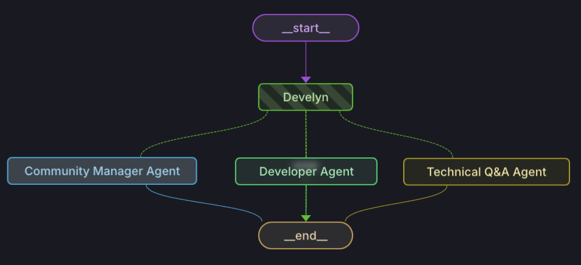

# Develyn - Your Developer Relations Agent 

This is an AI Agent that allows you to manage your community, answer technical questions, and generate code for your use cases for any Open Source project. This agent is built using LangGraph.

## Demo 

[](https://www.loom.com/share/d9aa2fc7257e42c7ab26db018634b16c)

## Features 

- **Community Manager Agent**: Handles general messages in your developer community (e.g., Discord) and routes them to the Community Manager who can respond to them or redirect them to the appropriate channel.
- **QA Agent**: Manages technical questions that do not require code generation.
- **Developer Agent**: Deals with technical questions that require code generation.

## Setup 

### Prerequisites

- Python 3.8+
- [Poetry](https://python-poetry.org/)

### Installation

1. Clone the repository:
   ```sh
   git clone https://github.com/openfunnel/develyn.git
   cd develyn
   ```

2. Install dependencies using Poetry:
   ```sh
   poetry install
   ```

### Running on Laggraph

To run the bot on Laggraph, follow these steps:

1. Fill in the .env.example file with keys and rename it to .env
2. For more details, look at this original langgraph-example [here](https://github.com/langchain-ai/langgraph-studio)

### Running as a Discord Bot

To run the bot as a Discord bot, follow these steps:

1. Create a Discord bot and get the token.
2. Set the token in your environment variables:
   ```sh
   export DISCORD_TOKEN=your_discord_token
   ```
3. Start the bot:
   ```sh
   poetry run python main.py
   ```

## Agents 

### Community Manager Agent

Handles general messages and routes them to the Community Manager.

### Technical QA Agent

Manages technical questions that do not require code generation. These are questions like:
- "Can project X do Y?"
- "Is it possible to do Y with project X?"

### Developer Agent

Deals with technical questions that require code generation. These are questions like:
- "How do I do Y with project X?"
- "What is the code to do Y with project X?"

The developer agent also runs the code on your system to check for errors, retries with errors, and finally returns the best effort code.

## Contributing 

Contributions are welcome!

## License 

This project is licensed under the MIT License.

## Contact 

For any questions or suggestions, feel free to open an issue or contact us at [adityalahiri13@gmail.com](mailto:adityalahiri13@gmail.com).

---